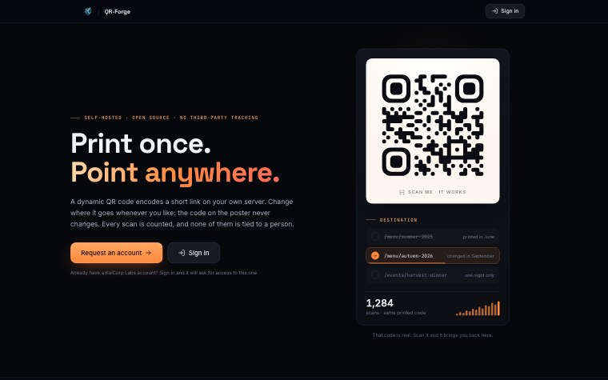

# QR-Forge

Dynamic and static QR codes, self-hosted. The printed QR never changes: you change where it points.

[](https://github.com/Ulzuhan/qr-forge/actions/workflows/ci.yml)
[](https://github.com/Ulzuhan/qr-forge/pkgs/container/qr-forge)
[](LICENSE)



- **Dynamic**: the QR encodes `<public URL>/r/<slug>`, which redirects to the destination and records a minimized scan (date, country, truncated user-agent; never IP or Referer). Edit the destination whenever you like without reprinting anything.
- **Static**: the QR encodes the content directly (URL, WiFi, email, text). It never touches the app, so there are no statistics — and it keeps working even when the server is down.

## Access

Accounts live in an **OIDC provider you point it at** — any standard one works: Authentik (what the original deployment runs), Keycloak, Zitadel, Auth0 — not here: signing in is an OIDC flow (`lib/oidc.ts`), and who gets in is decided by the provider. Without the OIDC variables set, nobody can sign in and nothing can be created — deliberate, not a misconfiguration. This application only keeps a mirror of the identity (`users.oidc_sub`) so it can tell who owns each QR, plus its own session — a cookie whose hash lives in the database, revocable. See `lib/auth.ts`.

Each account sees and manages **only its own QR codes**.

The only public route is **`/r/<slug>`**: it is what printed QR codes encode, and it has to work for anyone, always, without a session. Everything else requires a session and also checks ownership; requesting someone else's QR returns 404, not 403, so the response does not confirm that the slug exists.

## Environment variables

| Variable | Purpose |
|---|---|
| `QRFORGE_PUBLIC_URL` | Public URL the app is served from (e.g. `https://qr.kaicorplabs.com`). **This is what gets printed into the QR codes**: pin it in production, or a QR generated from localhost or from inside the VPN will carry that private URL onto paper. If unset, it is derived from the request. |
| `QRFORGE_OIDC_CLIENT_ID` / `_SECRET` | OIDC client credentials. Without them nobody can sign in. |
| `QRFORGE_OIDC_REDIRECT_URI` | Must match one of the URIs registered in the provider. |
| `QRFORGE_OIDC_ISSUER` | The provider's issuer URL. Every endpoint (authorize, token, userinfo, end-session, JWKS) is read from its `/.well-known/openid-configuration`, so no provider-specific paths are baked in |
| `QRFORGE_OIDC_INTERNAL_BASE` | The provider as this server sees it — redeeming the authorization code never leaves the internal network. Falls back to `PUBLIC_BASE`. |
| `QRFORGE_ACCOUNT_URL` | The provider's own account page — email, password, second factor, sessions. None of that belongs to this app, and without it the account menu simply does not link anywhere. Authentik serves it at `/if/user/`. |
| `QRFORGE_DB_PATH` | SQLite path (default `./qrforge.db`). |
| `QRFORGE_PUBLIC_HOST` | Public hostname the origin check compares against. Unset, the incoming `Host` is used, which is right behind a tunnel that preserves it — verified. Only needed behind a proxy that rewrites `Host` with an internal name. |
| `QRFORGE_SESSION_TTL_HOURS` | Session lifetime, default 12 h and clamped to 1–24 h. |
| `QRFORGE_MAX_QRS_PER_USER` | Per-account quota; default 1000. |
| `QRFORGE_MAX_CREATES_PER_HOUR` | Creation rate per identity and IP; default 120. |
| `QRFORGE_SCAN_RETENTION_DAYS` | Scan retention; default 365 days. |

## Development

```bash
npm run dev          # http://localhost:3000
QRFORGE_DB_PATH=/tmp/qrforge-dev.db QRFORGE_ALLOW_DB_RESET=YES npm run db:reset
npm run build && npm start
```

Production recipes for Docker Compose and a hardened systemd service are documented in [`DEPLOYMENT.md`](DEPLOYMENT.md).

## Tests

```bash
npm test           # unit tests, then the HTTP suite
npm run test:unit  # just the pure functions
npm run test:http  # just the suite, needs a build first
```

The HTTP suite starts its own server against a **fresh database built from the
schema** — never `qrforge.db`, which holds real accounts.

What it is really guarding: a dynamic QR is not a page, it is a piece of paper
**already printed** pointing at a URL that can be changed afterwards. Anybody who
manages to edit somebody else's destination redirects everyone scanning a poster
that has been on the wall for weeks — and whoever printed it cannot fix it. So the
first thing the suite checks is that another account gets **404** reading, editing,
deleting or asking for the stats of a code that is not theirs (404 rather than 403:
there is no reason to confirm to somebody probing that the code exists), and that the
destination survives those attempts untouched.

It also covers what a destination may be. `javascript:`, `data:`, `file:`, `ftp:` and
protocol-relative URLs are refused, because that destination ends up in a `Location`
header that the scanner's browser follows. A private address like
`http://192.168.1.50` **is** accepted, on purpose: the redirect resolves in the
scanner's browser, not on this server, so it reaches nothing here — and a QR for the
NAS at home is a legitimate use of this tool.

## Database

SQLite with Drizzle. `users` (mirror of the Authentik identity) · `sessions` · `qr_codes` (with `user_id`) · `qr_scans`. Foreign keys cascade, but SQLite only enforces them when the connection enables `PRAGMA foreign_keys = ON` — the app does (`db/index.ts`); the `sqlite3` CLI does **not**, so a manual `DELETE FROM users` leaves orphans behind.
